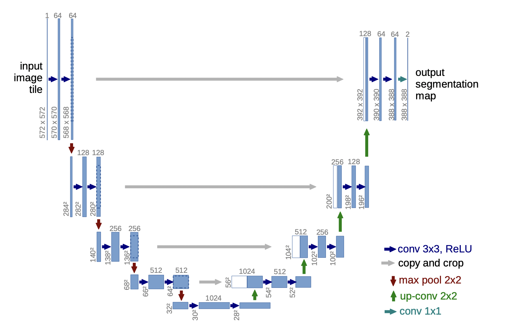

# Aerial Segmentation
Repo for TWM (Machine Vision Techniques) project @ WUT 24L semester

## TODO
- [ ] problem konwersji danych RGB -> maska
    - [ ] czy w AerialDrone używamy tylko maski z jednym kanałem czy kolorów z wieloma?
    - [ ] rozwiązać problem ze sposobem w jaki jest zakodowane gt w Dubai (kolorowe obrazki zamiast po prostu [0...5])
    - [ ] tak samo w UAVid - dane są zakodowane, tak, żeby dało się je wyświetlić, a nie do modelu
    - [ ] w jaki sposób, w AerialDrone, jest oznaczane to co trzeba przewidzieć (RGB classes czy to drugie)?
    - [ ] w AerialDrone, jak działa przetworzenie maski na tensor / PIL.Image (tzn. czy nie ma np. jakiegoś rescale, itd.)?
- [ ] literatura
    - [ ] jakie jest SOTA w tym problemie? (top 5)
    - [ ] dobre modele z Kaggle (po jednym dla każdego datasetu)
    - [ ] inne rzeczy warte uwagi
- [ ] inne
    - [ ] *deep dive* UNet
    - [ ] dodanie wymiarów tensorów w annotacjach / *type hints*
    - [ ] (opcjonalnie) publikacja na Kaggle
- [x] stworzenie funkcji ewaluacyjnej
- [x] ile klas w UAVid?
- [x] czy lepiej robić segmentację na podstawie jednego kanału czy trzech?
- [x] zapoznanie z libką *segmentation_models.pytorch*
- [x] zapoznanie z datasetem *INRIA*
- [x] zapoznanie z datasetem *Aerial Image Segmentation from Online Maps*
- [x] zapoznanie z datasetem *UAVid Semantic Segmentation Dataset*
- [x] zapoznanie z datasetem *Aerial Semantic Segmentation Drone Dataset*
- [x] doinstalować torcha z CUDA (skill issue xd)
- [x] dokończenie prezentacji

## Modele
| Model      | INRIA | UAVid | Dubai | AerialDrone |  
| ----------- | ----------- | ----------- | ----------- | ----------- |  
| UNet      | :heavy_check_mark:       | TBA   | TBA   |  TBA   | 
| UNet++   | IN PROGRESS        | TBA      | TBA      | TBA   | 
| DeepLabV3   | IN PROGRESS        | TBA      | TBA      | TBA   | 
| DeepLabV3+   | IN PROGRESS        | TBA      | TBA      | TBA   | 

## Dane

### Ilość klas w poszczególnych zbiorach
* `INRIA`: 2 (binary - *building* i *non-building*) [source](https://project.inria.fr/aerialimagelabeling/)
* `Dubai`: 6  [source](https://www.kaggle.com/datasets/humansintheloop/semantic-segmentation-of-aerial-imagery/data)
    - Building: #3C1098
    - Land (unpaved area): #8429F6
    - Road: #6EC1E4
    - Vegetation: #FEDD3A
    - Water: #E2A929
    - Unlabeled: #9B9B9B     
* `Aerial Drone`: 20 (tree, gras, other vegetation, dirt, gravel, rocks, water, paved area, pool, person, dog, car, bicycle, roof, wall, fence, fence-pole, window, door, obstacle) [source](https://www.kaggle.com/datasets/bulentsiyah/semantic-drone-dataset/data)
* `UAVid`: 8 [source](https://www.kaggle.com/code/alexalex02/semantic-segmentation-of-aerial-images)
    1. *building*: living houses, garages, skyscrapers, security booths, and buildings under construction.
    2. *road*: road or bridge surface that cars can run on legally. Parking lots are not included.
    3. *tree*: tall trees that have canopies and main trunks.
    4. *low vegetation*: grass, bushes and shrubs.
    5. *static car*: cars that are not moving, including static buses, trucks, automobiles, and tractors. Bicycles and motorcycles are not included.
    6. *moving car*: cars that are moving, including moving buses, trucks, automobiles, and tractors. Bicycles and motorcycles are not included.
    7. *human*: pedestrians, bikers, and all other humans occupied by different activities.
    8. *clutter*: all objects not belonging to any of the classes above.

### Ilość obrazków w poszczególnych zbiorach
* `INRIA`
    - `train`: 180 (dane są etykiety, trzeba ręcznie podzielić na train i val)
    - `test`: 144 (brak etykiet)
* `Dubai`
    - `train`: 72 (dane są etykiety, trzeba ręcznie podzielić na train, val i test)
* `Aerial Drone`
    - `train`: 400 (dane są etykiety, trzeba ręcznie podzielić na train, val i test)
* `UAVid`
    - `train`: 200
    - `val`: 70
    - `test`: 10

## Problemy
* model musi przyjmować dowolny (albo z dużego zbioru) rozmiar obrazka, a nie stały, bo datasety mają różne rozmiary obrazków, a nawet mogą być różne w ramach datasetu
* w większości zbiorów danych, `groundtruth` jest zakodowane w postaci obrazków RGB, gdzie każdy kolor odpowiada innej klasie, trzeba je konwertować na tensor z etykietami, bo taki zwracają modele [related gh issue](https://github.com/qubvel/segmentation_models/issues/137)
    - `UAVid` - maska ma 3 kanały, zapisane jako arbitralne wartości RGB
    - `Aerial Drone` - maska ma 1 kanał, który potem jest jakoś przepisywany przy wyświetlaniu
    - `Dubai` - maska ma 1 kanał, który potem jest jakoś przepisywany przy wyświetlaniu

## Prezka
* opisane w [readme](./docs/README.md)

## Intro
Dobra, żeby zacząć już coś robić w projekcie, proponuję pójść w stronę przeglądu / ensemble różnych modeli i/lub datasetów, porównać, itd.
* 'na zewnątrz' sprzedamy to jako właśnie taki przegląd, porównanie np. czy modele dobre dla zdj z satelitów, są dobre też dla zdj z dronów, biorąc też pod uwagę, np. koszt treningu / inferencji
* 'do wewnątrz', czyli dla nas, to będzie po prostu zapoznanie się z aktualnym stanem dziedziny, nie będziemy wymyślać nowych rzeczy, jak na PBAD xd 

## Uwagi
* ze względu na architekturę UNet, której używamy, ważne jest, żeby wymiary danych wejściowych były wielokrotnością 32 (zob. [ta funkcja](/src/datasets/utils/ResizeToDivisibleBy32.py))

## Materiały
Wstępnie zebrałem trochę materiałów, proponuję od nich zacząć zapoznawanie się z rzeczami. Kolejne etapy projektu możemy spokojnie zrobić wcześniej niż termin i potem tylko oddawać

* repozytoria
    * [praca z INRIA dataset](https://github.com/margokhokhlova/aerial_segmentation)
    * [praca z Aerial Image Segmentation from Online Maps](https://github.com/alpemek/aerial-segmentation/tree/master)
* datasety
    * [UAVid Semantic Segmentation Dataset](https://www.kaggle.com/datasets/titan15555/uavid-semantic-segmentation-dataset)
    * [Aerial Semantic Segmentation Drone Dataset](https://www.kaggle.com/datasets/bulentsiyah/semantic-drone-dataset)
    * [Semantic segmentation of aerial imagery](https://www.kaggle.com/datasets/humansintheloop/semantic-segmentation-of-aerial-imagery)
* rozwiązania z kaggle
    * [rozwiązanie UAVid Semantic Segmentation Dataset](https://www.kaggle.com/code/alexalex02/semantic-segmentation-of-aerial-images/notebook)
* libki
    * [potężna libka z gotowymi modelami do segmentacji](https://github.com/qubvel/segmentation_models.pytorch)
* papiery
    * [Learning Aerial Image Segmentation from Online Maps](https://ethz.ch/content/dam/ethz/special-interest/baug/igp/photogrammetry-remote-sensing-dam/documents/pdf/Papers/Learning%20Aerial%20Image.pdf)
    * [Drone Depth and Obstacle Segmentation Dataset](https://arxiv.org/pdf/2312.12494.pdf)
    * [Varied Drone Dataset for Semantic Segmentation](https://arxiv.org/pdf/2305.13608.pdf)
